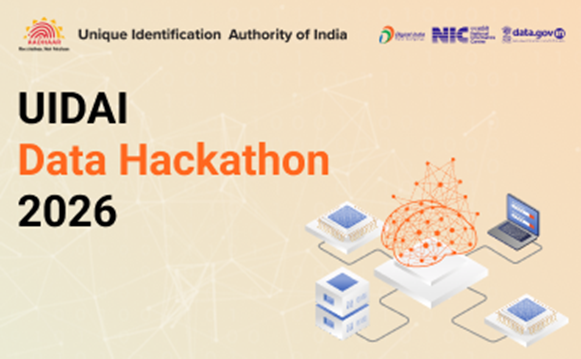

# 📊 Aadhaar Enrolment & Update Analysis  

### UIDAI Data Hackathon 2026 (UIDAI)

A data-driven analytical project focused on understanding Aadhaar enrolment patterns, demographic and biometric update behaviors, and operational service bottlenecks. This repository provides transparent, reproducible insights to support scalable, citizen-centric governance solutions.

---

## 🧭 Project Objectives

- Analyze Aadhaar enrolment and update datasets to uncover systemic inefficiencies  
- Identify demographic and biometric update patterns across age groups and states  
- Pinpoint high-pressure service zones and root causes of overcrowding  
- Translate raw data insights into actionable policy and service recommendations  

---

## 📁 Analysis Notebooks Overview

### 1️⃣ Enrolment Data Cleaning & Analysis  
**Notebook:** `enrolment_cleaning.ipynb`  

This notebook focuses on cleaning, standardizing, and preprocessing Aadhaar enrolment datasets.

**Key Steps**
- Merging multiple CSV files into a unified dataset  
- Standardizing state and region naming conventions  
- Removing duplicates and resolving inconsistencies  
- Preparing age-group buckets and time-series features for analysis  

📌 **Purpose:** Enable accurate identification of enrolment trends, seasonal spikes, and peak service load periods across states.

---

### 2️⃣ Demographic Update Analysis  
**Notebook:** `demographic_analysis.ipynb`  

This notebook examines demographic update requests, including name, address, date of birth, and mobile number changes.

**Key Insights**
- Identification of high-frequency update types  
- Adult-dominated update behavior patterns  
- Evidence of repeated centre visits for minor updates  

📌 **Purpose:** Provide data-backed justification for online self-service filtering, awareness campaigns, and reduced physical dependency.

---

### 3️⃣ Biometric Update & Failure Analysis  
**Notebook:** `biometric_analysis.ipynb`  

This notebook analyzes biometric update trends and failure-prone user segments.

**Key Focus Areas**
- Age-wise biometric update distribution  
- Elevated failure rates among senior citizens and manual laborers  
- Correlation between biometric updates and total enrolment volume  

📌 **Purpose:** Support iris-based authentication prioritization, assisted enrolment, and doorstep service recommendations.

---

### 4️⃣ Final Insights & Policy Recommendations  
**Notebook:** `final_insights.ipynb`  

This notebook consolidates findings from all analyses and maps them to real-world service challenges.

**Highlights**
- Identification of state-wise service pressure zones  
- Root cause analysis of overcrowding and repeat visits  
- Data-backed justification for proposed policy and operational solutions  

📌 **Purpose:** Bridge the gap between raw data analysis and actionable governance insights.

---

## 🔍 Why This Matters

By providing direct access to all analytical notebooks, this project ensures:

- **Transparency:** Every insight is traceable to visible data processing steps  
- **Reproducibility:** Analyses can be independently verified and extended  
- **Scalability:** The same framework can be reused for future UIDAI datasets and similar public service systems  

---

## 🛠️ Tech Stack

- Python (Pandas, NumPy)  
- Jupyter Notebook  
- Data Visualization Libraries (Matplotlib / Seaborn)  

---

## 📌 Intended Impact

This project aims to assist policymakers, system designers, and public service administrators in building more efficient, inclusive, and citizen-friendly Aadhaar service delivery mechanisms.

---

✨ Built with a focus on evidence-driven governance and scalable public impact.
